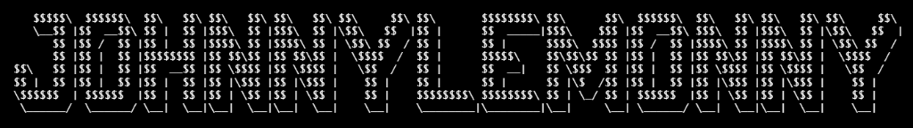

<p align="center">
  
</p>

<p align="center">
  
</p>

<h1 align="center">NutraFlux</h1>

<p align="center">
  <strong>Fuel your nutritional momentum with precision.</strong><br>
  A professional, local-first daily calorie and macro tracker built for speed, privacy, and technical excellence.
</p>

<p align="center">
  <a href="https://github.com/johnnylemonny/nutraflux/actions"></a>
  <a href="https://github.com/johnnylemonny/nutraflux/blob/main/LICENSE"></a>
  <a href="https://johnnylemonny.github.io/nutraflux/"></a>
</p>

---

## 🌟 Overview

**NutraFlux** is a high-performance nutritional tracking application designed for those who value speed and data privacy. It eliminates the friction of traditional trackers by offering an instant, search-first logging experience combined with a stunning glassmorphism interface.

Built with a **local-first** architecture, NutraFlux ensures your personal data never leaves your browser, providing a zero-latency experience that works entirely offline.

## ✨ Features

- ⚡️ **Nutra-Speed Logging:** Instant search and log meals with a search-first interface.
- 🔍 **Metri-Food Lookup:** Advanced full-text search with wildcard support over a compact local catalog.
- 🥗 **Flux Categories:** Categorize entries into Breakfast, Lunch, Dinner, and Snacks with real-time feedback.
- 📊 **Precision Momentum:** Professional progress indicators and calorie budgeting to visualize your intake.
- ❤️ **Smart Memory:** Persistent favorites and recently used foods for one-tap tracking.
- 🌓 **Technical Aesthetic:** State-of-the-art glassmorphism UI with Light, Dark, and System mode support.
- 📱 **Adaptive Design:** Seamless performance across mobile, tablet, and desktop viewports.

## 🛠️ Tech Stack

NutraFlux leverages the latest frontend engineering standards:

- **Core:** [React 19](https://react.dev/) + [TypeScript](https://www.typescriptlang.org/)
- **Build Tool:** [Vite](https://vitejs.dev/)
- **Styling:** [Tailwind CSS 4](https://tailwindcss.com/) (OKLCH color system + backdrop-filter)
- **Icons:** [Lucide React](https://lucide.dev/)
- **UI Logic:** Custom high-resilience components with [Radix UI](https://www.radix-ui.com/) primitives
- **Notifications:** [Sonner](https://sonner.stevenly.me/)

## 🚀 Getting Started

### Prerequisites

- **Node.js:** 22.0.0 or higher
- **Package Manager:** [pnpm](https://pnpm.io/) 10+

### Installation

1. Clone the repository:
   ```bash
   git clone https://github.com/johnnylemonny/nutraflux.git
   cd nutraflux
   ```

2. Install dependencies:
   ```bash
   pnpm install
   ```

3. Run the development server:
   ```bash
   pnpm dev
   ```

4. Build for production:
   ```bash
   pnpm build
   ```

## 🏗️ Project Structure

```text
src/
├── components/   # Reusable UI components & Design System
├── data/         # Food catalogs and presets
├── hooks/        # Custom React hooks (tracker logic, theme)
├── lib/          # Utilities, math logic, and helper functions
├── types/        # TypeScript interfaces and types
└── App.tsx       # Main application entry point
```

## 🔐 Privacy & Local-First

NutraFlux is strictly **local-first**. All nutritional data, settings, and food history are stored in your browser's `localStorage`. No trackers, no cookies, no cloud syncing—your health data belongs to you.

## 🤝 Contributing

This is an open-source project and contributions are welcome! 
1. Fork the Project
2. Create your Feature Branch (`git checkout -b feature/AmazingFeature`)
3. Commit your Changes (`git commit -m 'Add some AmazingFeature'`)
4. Push to the Branch (`git push origin feature/AmazingFeature`)
5. Open a Pull Request

## 👤 Author

**johnnylemonny**  
Find more of my open-source work on [GitHub](https://github.com/johnnylemonny).

---

<p align="center">
  <i>Built with passion as part of a public open-source fitness ecosystem.</i>
</p>

<p align="center">
<pre align="center">
  _   _       _              ______ _             
 | \ | |     | |            |  ____| |            
 |  \| |_   _| |_ _ __ __ _ | |__  | |_   ___  __ 
 | . ` | | | | __| '__/ _` ||  __| | | | | \ \/ / 
 | |\  | |_| | |_| | | (_| || |    | | |_| |>  <  
 |_| \_|\__,_|\__|_|  \__,_||_|    |_|\__,_/_/\_\ 
</pre>
</p>
