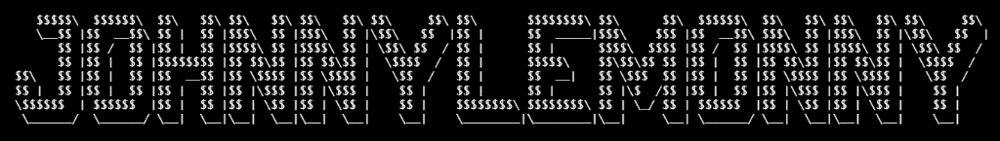

<div align="center">
  
  
  <br />

  

  # NutraFlux
  ### Professional • Free & Private • Dual-Language (PL / EN)

  [](https://github.com/johnnylemonny/NutraFlux/actions/workflows/deploy.yml)
  [](https://github.com/johnnylemonny/NutraFlux/actions/workflows/super-linter.yml)
  [](https://github.com/johnnylemonny/NutraFlux/actions/workflows/codeql.yml)
  [](https://github.com/johnnylemonny/NutraFlux/blob/main/LICENSE)
  [](https://johnnylemonny.github.io/NutraFlux/)

  **Your daily nutrition and calorie companion.**  
  NutraFlux is an accessible, commercial-grade web application for tracking daily calories and macronutrients without accounts, subscriptions, or invasive ads. 100% private, offline-ready, and community-funded.

  [Live App](https://johnnylemonny.github.io/NutraFlux/) • [Report Feedback / Bug](https://github.com/johnnylemonny/NutraFlux/issues) • [Support the Project ☕](https://buymeacoffee.com/zdfpbnc5iv)

</div>

---

## 📖 Table of Contents

- [🌟 Overview](#-overview)
- [✨ Key Features](#-key-features)
- [🛠️ Tech Stack](#️-tech-stack)
- [🚀 Getting Started](#-getting-started)
- [🏗️ Project Architecture](#️-project-architecture)
- [🔐 Privacy & Data Philosophy](#-privacy--data-philosophy)
- [🤝 Contributing](#-contributing)
- [☕ Support & Donations](#-support--donations)
- [⚖️ License](#️-license)

---

## 🌟 Overview

**NutraFlux** is a clean, accessible nutrition and calorie tracker built for everyday health-conscious individuals. It removes the stress of typical fitness apps:
- **Zero forced accounts or logins:** Your data is strictly stored in your device's browser.
- **Zero ads or paywalls:** Free forever, supported purely by community donations.
- **Dual-language (PL / EN):** Seamlessly detects Polish or English from your browser preferences with a quick toggle button.
- **Instant speed:** 100% offline-ready, loading instantly on smartphones and desktop browsers.

---

## ✨ Key Features

| Feature | Description |
| :--- | :--- |
| 🌐 **Bilingual (PL & EN)** | Fully localized interface with automatic browser language detection and instant toggle. |
| ⚡ **Fast Food Lookup** | Search across 2,000+ USDA-verified foods with wildcard support or log custom meals in seconds. |
| 🥗 **4 Daily Meals** | Streamlined logging for Breakfast, Lunch, Dinner, and Snacks. |
| 🎯 **Goal Presets** | One-tap goal setup: Weight Loss (1,700 kcal), Maintenance (2,100 kcal), or Muscle Gain (2,500 kcal). |
| 🗑️ **Granular Control** | Duplicate or delete entries with single taps and protected by a safe reset dialog. |
| 📤 **Daily Summary Export** | Export your daily report via native Web Share on mobile or copy to clipboard on desktop. |
| ☕ **Community Funded** | Integrated Buy Me a Coffee / GitHub Sponsors donation cards for supporters. |
| 💬 **In-App Feedback** | Built-in modal for submitting feature requests and bug reports directly to GitHub. |
| 🌒 **Adaptive Theme** | Native Dark / Light mode with smooth eye-comfort transitions. |
| 🔍 **SEO & Structured Data** | High-performance Schema.org `WebApplication` and `FAQPage` metadata. |

---

## 🛠️ Tech Stack

- **Core:** [React 19](https://react.dev/) + [TypeScript](https://www.typescriptlang.org/) (Strict Mode)
- **Framework:** [Vite 8](https://vitejs.dev/) with optimized production bundling
- **Testing:** [Vitest 3](https://vitest.dev/) + [Testing Library](https://testing-library.com/) (21 unit and integration tests)
- **Styling:** [Tailwind CSS 4](https://tailwindcss.com/)
- **UI Components:** [Radix UI](https://www.radix-ui.com/) primitives
- **Icons & Notifications:** [Lucide React](https://lucide.dev/) & [React-Toastify](https://github.com/fkhadra/react-toastify)
- **Deployment:** Vercel & GitHub Pages ready (`vercel.json`, `robots.txt`, `sitemap.xml`)

---

## 🚀 Getting Started

### 📋 Prerequisites

- **Node.js:** `v22.0.0` or higher
- **pnpm:** `v10.0.0` or higher

### ⚙️ Installation & Usage

1. **Clone the repository:**
   ```bash
   git clone https://github.com/johnnylemonny/NutraFlux.git
   cd NutraFlux
   ```

2. **Install dependencies:**
   ```bash
   pnpm install
   ```

3. **Start local dev server:**
   ```bash
   pnpm dev
   ```

4. **Run test suite:**
   ```bash
   pnpm test
   ```

5. **Typecheck & Lint:**
   ```bash
   pnpm typecheck
   pnpm lint
   ```

6. **Production build:**
   ```bash
   pnpm build
   ```

---

## ☕ Support & Donations

NutraFlux is completely free, open-source, and has no advertising or premium tiers. If this application helps you on your fitness or diet journey, consider supporting ongoing development:

- ☕ **Buy Me a Coffee:** [buymeacoffee.com/zdfpbnc5iv](https://buymeacoffee.com/zdfpbnc5iv)
- 💖 **GitHub Sponsors:** [github.com/sponsors/johnnylemonny](https://github.com/sponsors/johnnylemonny)

---

## ⚖️ License

Distributed under the **GNU Affero General Public License v3.0 (AGPL-3.0)**.  
See [`LICENSE`](LICENSE) for details.
